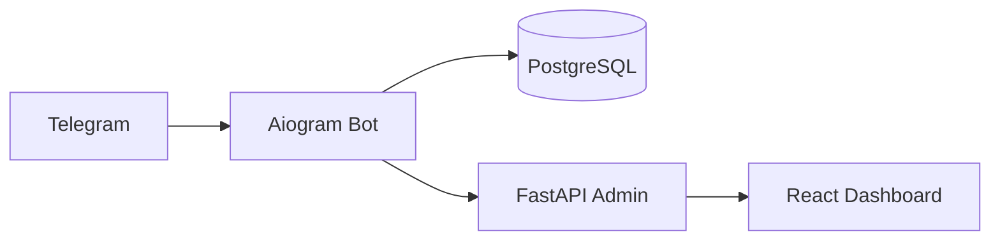

# Telegram-бот для поиска мастеров (Алматы)

> MVP сервиса: «сломался кран → зашел в бота → нашел мастера → починил».

## 🔥 Что делаем в MVP

* Регистрация ролей: Клиент / Мастер / Партнёр (ЖК)
* Создание заказа клиентом: категория → адрес → время → описание (+медиа)
* Рассылка заказа мастерам по району и категории; сбор офферов (ставок) в течение 2 минут
* Выбор мастера клиентом по цене и рейтингу, обмен контактами
* Закрытие заказа и оценка (1–5 ⭐)
* Учёт комиссии сервиса (10%) и партнёра (5%)

## 🧱 Технологический стек

* **Python 3.12**
* **Aiogram 3.x** (бот)
* **FastAPI** (админка, веб-хуки)
* **PostgreSQL** (+SQLAlchemy + Alembic)
* **Docker Compose** (локально), Ubuntu VPS (прод)



## 📂 Структура репозитория

```
.
├── app/
│   ├── bot/
│   │   ├── __init__.py
│   │   ├── main.py               # точка входа бота
│   │   ├── handlers/
│   │   │   ├── client.py         # сценарии клиента
│   │   │   ├── master.py         # сценарии мастера
│   │   │   └── partner.py        # сценарии партнёра
│   │   ├── keyboards/
│   │   ├── middlewares/
│   │   └── states.py
│   ├── core/
│   │   ├── config.py             # pydantic Settings
│   │   ├── db.py                 # сессии SQLAlchemy
│   │   └── logging.py
│   ├── models/                   # SQLAlchemy модели
│   │   ├── user.py
│   │   ├── order.py
│   │   ├── bid.py
│   │   ├── rating.py
│   │   └── partner.py
│   ├── services/
│   │   ├── orders.py             # бизнес-логика заказов
│   │   ├── pricing.py            # подсказки по цене
│   │   └── notifications.py      # рассылки мастерам
│   ├── admin/
│   │   └── main.py               # FastAPI (админ, health, вебхуки)
│   └── utils/
│       └── geozones.py           # работа с районами города
├── alembic/
│   └── versions/
├── alembic.ini
├── pyproject.toml (или requirements.txt)
├── docker-compose.yml
├── .env.example
└── README.md
```

## 🗺️ Модель данных (минимум)

**users**: id, tg\_id, role{client,master,partner,admin}, name, phone, rating\_avg, zones\[], created\_at

**partners**: id, user\_id, slug, referral\_code, payout\_percent (по умолчанию 5%)

**orders**: id, client\_id, category, zone, address, when\_at, description, media\[], status{new,assigned,done,cancelled}, created\_at

**bids**: id, order\_id, master\_id, price, note, created\_at, status{active,selected,rejected}

**ratings**: id, order\_id, rater\_id, ratee\_id, stars (1..5), comment

**payouts**: id, order\_id, master\_id, amount\_master, amount\_service (10%), amount\_partner (5%), status

> Миграции — Alembic; внешние ключи, индексы по (orders.category, orders.zone, orders.status), bids(order\_id, created\_at).

## ⚙️ Быстрый старт (локально)

1. Создай бота у @BotFather, получи `BOT_TOKEN`.
2. Скопируй `.env.example` → `.env` и заполни:

```
BOT_TOKEN=123:ABC
POSTGRES_HOST=localhost
POSTGRES_PORT=5432
POSTGRES_DB=masterbot
POSTGRES_USER=masterbot
POSTGRES_PASSWORD=masterbot
ADMIN_SECRET=change-me
TZ=Asia/Almaty
```

3. Запусти базы и сервисы:

```bash
docker compose up -d postgres
```

4. Установи зависимости и примени миграции:

```bash
# через pip
python -m venv .venv && source .venv/bin/activate
pip install -r requirements.txt
alembic upgrade head
```

5. Стартуй бота и админку:

```bash
python -m app.bot.main
uvicorn app.admin.main:app --reload --port 8000
```

### Docker Compose (пример)

```yaml
services:
  postgres:
    image: postgres:16
    environment:
      POSTGRES_DB: masterbot
      POSTGRES_USER: masterbot
      POSTGRES_PASSWORD: masterbot
    ports: ["5432:5432"]
    volumes:
      - pgdata:/var/lib/postgresql/data
volumes:
  pgdata:
```

## 🧭 Пользовательские сценарии (MVP)

### Клиент

1. Выбирает категорию (сантехник, электрик, маляр и т.д.)
2. Указывает район/адрес → время → описание → медиа
3. Получает офферы от мастеров (окно 2 минуты), выбирает мастера
4. По окончании — ставит оценку 1–5 ⭐

### Мастер

* Регистрирует зоны работ, получает уведомления по своим категориям и зонам
* Отправляет ставку (цена + заметка) в течение 2 минут
* При выборе — получает контакты клиента, закрывает заказ → попадает в расчёт по комиссии

### Партнёр (ЖК)

* Регистрирует реферальную ссылку `t.me/<bot>?start=partner_<код>`
* Получает 5% с заказов, пришедших через ссылку

## 🧠 Промт для ИИ-диспетчера (NLP нормализация заявки)

**Роль (system):**
Вы — диспетчер сервиса бытовых услуг в Алматы. По тексту клиента вы:

1. Определяете категорию работ из допустимого набора.
2. Выделяете адрес/район, желаемое время (сейчас/сегодня/завтра/дата-время).
3. Нормализуете задачу в краткий заголовок + детальное описание.
4. Проверяете полноту данных; если чего-то не хватает — задаёте 1–2 уточняющих вопроса.
5. Не придумываете цены — только подсказка по диапазону, если очень очевидно.
   Возвращайте ответ строго в JSON по схеме ниже.

**Данные настроек (developer):**

```
{"city": "Алматы", "zones": ["Алмалинский","Бостандыкский","Жетысуский","Медеуский","Турксибский","Ауэзовский","Наурызбайский"],
 "categories": ["Сантехник","Электрик","Плотник","Окна","Двери","Замки","Кафель","Маляр","Кондиционеры","Вентиляция","Клининг"]}
```

**Формат ответа (JSON Schema):**

```json
{
  "title": "string",
  "category": "Сантехник | Электрик | Маляр | ...",
  "zone": "string | null",
  "address": "string | null",
  "when": {
    "type": "now | in_1h | evening | tomorrow | datetime",
    "datetime": "YYYY-MM-DDTHH:mm | null"
  },
  "description": "string",
  "attachments": ["file_id", "..."],
  "missing": ["zone", "address", "when", "attachments"],
  "follow_up": "string | null"
}
```

**Примеры вопросов для уточнения:**

* «Уточните, пожалуйста, адрес или хотя бы район?»
* «Когда удобно принять мастера: сейчас, вечером или завтра?»
* «Подтвердите категорию: это сантехника или клининг?»

## 🤖 Промт для ИИ-подсказок цены (опционально)

**Роль (system):** Оценщик диапазона стоимости в Алматы. На вход: категория, краткое описание, ориентиры по рынку.

* Отвечайте диапазоном (мин–макс) и факторами, влияющими на цену. Не давайте окончательной цены.
* Если данных мало — просите 1 вопрос.

**Формат ответа:**

```json
{"range": {"min": 5000, "max": 20000}, "factors": ["срочность","дистанция","сложность"], "need_more": null}
```

## 🚦 Бизнес-правила комиссий (MVP)

* Комиссия сервиса — **10%**, партнёра (если есть) — **5%**. Остальное мастеру.
* Окно ставок: **2 минуты** после публикации заказа.
* Рейтинг мастера — средняя оцена за последние 30 заказов.

## 📑 Команды разработчика

```bash
# генерация миграций
alembic revision --autogenerate -m "init"
# накатить
alembic upgrade head
# локальный запуск бота
python -m app.bot.main
# локальный запуск админки
uvicorn app.admin.main:app --reload --port 8000
```

## 🗺️ Roadmap

* [ ] Нормализация заявок через ИИ (классификация + извлечение адреса/времени)
* [ ] Блок предоплаты (escrow) и защита от мошенничества
* [ ] Выплаты мастерам и партнёрам, отчётность
* [ ] Премиум-подписка для мастеров

## Лицензия

MIT (на ваше усмотрение).
